# DOKUMENTASI JARKOM PRAKTIKUM 2

## ANGGOTA

| Nama                        | NRP        |
| --------------------------- | ---------- |
| Athalla Barka Fadhil        | 5027231018 |
| Jody Hezekiah Tanasa Sagala | 5027221050 |

SOAL: [PRAKTIKUM-MODUL-2](https://docs.google.com/document/d/1_fe7aJ1Yq5xQLb7NjR_BoH00GFyinYweE9pLYxOzSzY/edit)

---

# IMPORTANT

## PERSISTENT DISK (ALL NODES)

---

jalanin ini sekali aja di SEMUA NODES (kecuali Nusantara)
Masuk web console

```
cp -r /etc /root/etc-persistent
cp -r /usr /root/usr-persistent
cp -r /var /root/var-persistent

mount --bind /root/etc-persistent /etc
mount --bind /root/usr-persistent /usr
mount --bind /root/var-persistent /var
```

`vi /etc/fstab`
isi begini:

```
/root/etc-persistent /etc none bind 0 0
/root/usr-persistent /usr none bind 0 0
/root/var-persistent /var none bind 0 0
```

`cd /root`
`vi restore.sh`
isi begini:

```
#!/bin/bash
cp -r /root/etc-persistent/* /etc/
cp -r /root/usr-persistent/* /usr/
cp -r /root/var-persistent/* /var/

mount --bind /root/etc-persistent /etc
mount --bind /root/usr-persistent /usr
mount --bind /root/var-persistent /var
```

cara penggunaan:
misal ke reset tinggal jalanin

```
bash /root/restore.sh
```

IMPORTANT
Klo habis pake restore.sh, service harus distart manual
contoh: service bind9 start

Q: Emang bakal ke reset?
A: Klo engga berarti keren

## TOPOLOGY

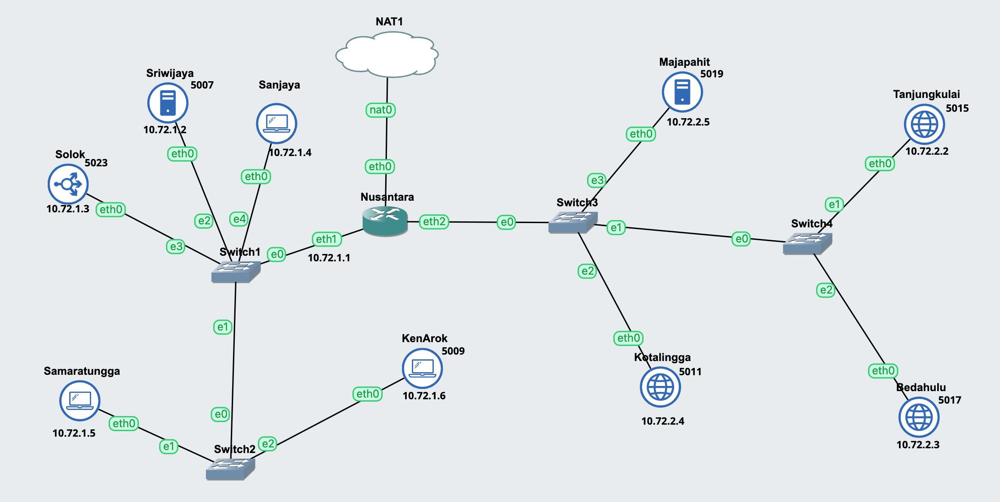

## SOAL 1

NOTES:
IP `10.72.1.2` itu IP Sriwijaya (DNS MASTER)

---

IP `10.72.2.5` itu IP Majapahit (DNS SLAVE)

### Nusantara

```
auto eth0
iface eth0 inet dhcp

auto eth1
iface eth1 inet static
	address 10.72.1.1
	netmask 255.255.255.0

auto eth2
iface eth2 inet static
	address 10.72.2.1
	netmask 255.255.255.0

up iptables -t nat -A POSTROUTING -o eth0 -j MASQUERADE -s 10.72.0.0/16
```

### Tanjungkulai

```
auto eth0
iface eth0 inet static
  address 10.72.2.2
  netmask 255.255.255.0
  gateway 10.72.2.1
up echo nameserver 10.72.1.2 > /etc/resolv.conf
up echo nameserver 10.72.2.5 >> /etc/resolv.conf
up echo nameserver 192.168.122.1 >> /etc/resolv.conf
```

### Bedahulu

```
auto eth0
iface eth0 inet static
  address 10.72.2.3
  netmask 255.255.255.0
  gateway 10.72.2.1

up echo nameserver 10.72.1.2 > /etc/resolv.conf
up echo nameserver 10.72.2.5 >> /etc/resolv.conf
up echo nameserver 192.168.122.1 >> /etc/resolv.conf
```

### Sriwijaya

```
auto eth0
iface eth0 inet static
  address 10.72.1.2
  netmask 255.255.255.0
  gateway 10.72.1.1

up echo nameserver 192.168.122.1 > /etc/resolv.conf
```

### Majapahit

```
auto eth0
iface eth0 inet static
  address 10.72.2.5
  netmask 255.255.255.0
  gateway 10.72.2.1

up echo nameserver 10.72.1.2 > /etc/resolv.conf
up echo nameserver 192.168.122.1 >> /etc/resolv.conf
```

### KenArok

```
auto eth0
iface eth0 inet static
  address 10.72.1.6
  netmask 255.255.255.0
  gateway 10.72.1.1

up echo nameserver 10.72.1.2 > /etc/resolv.conf
up echo nameserver 10.72.2.5 >> /etc/resolv.conf
```

### Kotalingga

```
aut0 eth0
iface eth0 inet static
  address 10.72.2.4
  netmask 255.255.255.0
  gateway 10.72.2.1

up echo nameserver 10.72.1.2 > /etc/resolv.conf
up echo nameserver 10.72.2.5 >> /etc/resolv.conf
up echo nameserver 192.168.122.1 >> /etc/resolv.conf
```

### Samaratungga

```
auto eth0
iface eth0 inet static
  address 10.72.1.5
  netmask 255.255.255.0
  gateway 10.72.1.1

up echo nameserver 10.72.1.2 > /etc/resolv.conf
up echo nameserver 10.72.2.5 >> /etc/resolv.conf
up echo nameserver 192.168.122.1 >> /etc/resolv.conf
```

### Solok

```
auto eth0
iface eth0 inet static
  address 10.72.1.3
  netmask 255.255.255.0
  gateway 10.72.1.1

up echo nameserver 10.72.1.2 > /etc/resolv.conf
up echo nameserver 10.72.2.5 >> /etc/resolv.conf
up echo nameserver 192.168.122.1 >> /etc/resolv.conf
```

### Sanjaya

```
auto eth0
iface eth0 inet static
  address 10.72.1.4
  netmask 255.255.255.0
  gateway 10.72.1.1

up echo nameserver 10.72.1.2 > /etc/resolv.conf
up echo nameserver 10.72.2.5 >> /etc/resolv.conf
up echo nameserver 192.168.122.1 >> /etc/resolv.conf
```

Notes:

- `nameserver 192.168.122.1` hanya digunakan untuk install2 package di awal, nantinya yang punya nameserver itu cuman Majapahit
- reload node setiap kali habis edit network configuration

## SETUP CLIENT

(yang gambar laptop)
Masuk web consolenya
`apt update && apt install dnsutils lynx -y`

## SOAL 2

Masuk ke Web Console Sriwijaya

1. `apt update && apt install bind9 dnsutils -y`
2. `cd /etc/bind`
3. `vi named.conf.local`

```
// Didalam named.conf.local


//TEMPLATE (HAPUS //)
//zone "namadomain.itxx.com" {
//  type master;
//  file "/etc/bind/itxx/namadomain.itxx.com";
//};

zone "sudarsana.it17.com" {
  type master;
  file "/etc/bind/it17/sudarsana.it17.com";
};

// SAVE FILE
```

4. `mkdir /etc/bind/it17`
5. `cd it17`
6. `cp ../db.local sudarsana.it17.com`
7. `vi sudarsana.it17.com`

Nanti tampilannya seperti ini
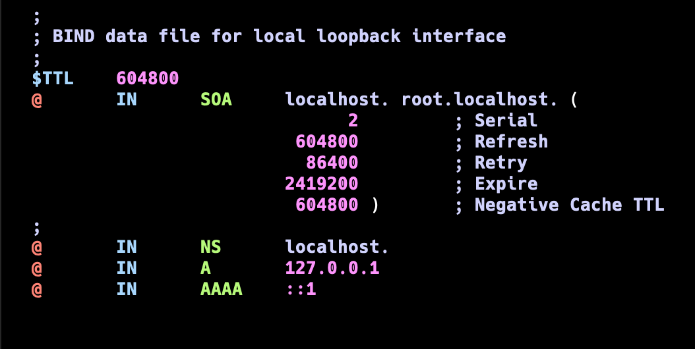

Ubah menjadi seperti ini
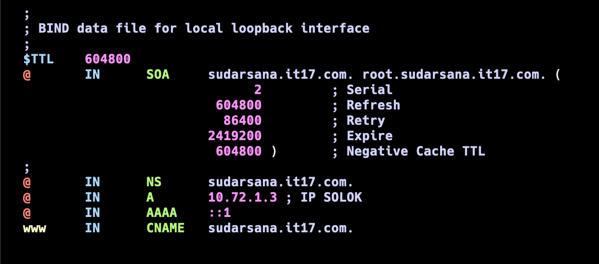

8. `service bind9 restart`
   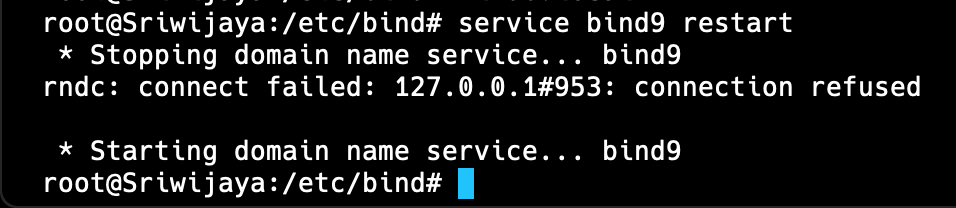

Untuk mengecek error pada config:
`named-checkconf`

Untuk mengecek error pada config zone:

```
named-checkzone namadomain.itxx.com /etc/bind/itxx/namadomain.itxx.com
```

9. Masuk ke web console client bebas (yang gambar laptop)

10. Pastiin udah ada nameserver dari DNSnya
    cek `cat /etc/resolv.conf`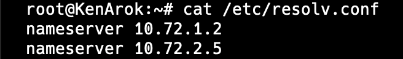
11. Kalo GAADA di tambahin

    ```
    echo nameserver 10.72.1.2 >> /etc/resolv.conf
    ```

    ```
    echo nameserver 10.72.1.5 >> /etc/resolv.conf
    ```

    notes:
    `10.72.1.2` disini itu IP dari Sriwijaya (DNS MASTER)
    `10.72.2.5` disini itu IP dari Majapahit (DNS SLAVE)

12. ping sudarsana.it17.com
    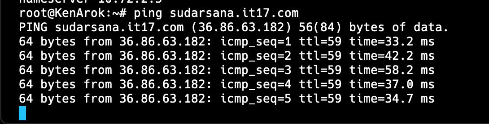
    yey berhasil

## SOAL 3

Masuk ke Web Console Sriwijaya

1. `cd /etc/bind`
2. `vi named.conf.local`

```
// Didalam named.conf.local


//TEMPLATE (HAPUS //)
//zone "namadomain.itxx.com" {
//  type master;
//  file "/etc/bind/itxx/namadomain.itxx.com";
//};

zone "sudarsana.it17.com" {
  type master;
  file "/etc/bind/it17/sudarsana.it17.com";
};

zone "pasopati.it17.com" {
  type master;
  file "/etc/bind/it17/pasopati.it17.com";
};

// SAVE FILE
```

3. `cd it17`
4. `cp sudarsana.it17.com pasopati.it17.com`
5. `vi pasopati.it17.com`

Nanti tampilannya seperti ini


Ubah menjadi seperti ini
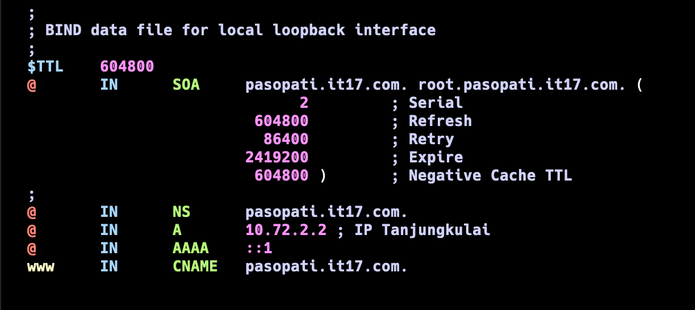 8. `service bind9 restart`


Untuk mengecek error pada config:
`named-checkconf`

Untuk mengecek error pada config zone:

```
named-checkzone namazone.itxx.com /etc/bind/itxx/namazone.itxx.com
```

## SOAL 4

step sama kek soal 2 dan 3

## SOAL 5

1. Masuk ke web console client (yang gambar laptop)
2. jalanin command di bawah
   Notes: sebernya gaperlu karena di Network Configuration tadi udah di add tapi kalo gabisa pake ini:

```
echo nameserver 10.72.1.2 >> /etc/resolv.conf
```

```
echo nameserver 10.72.1.5 >> /etc/resolv.conf
```

notes:
`10.72.1.2` disini itu IP dari Sriwijaya (DNS MASTER)
`10.72.2.5` disini itu IP dari Majapahit (DNS SLAVE)

## SOAL 6

1. Masuk web console Sriwijaya
2. `cd /etc/bind`
3. `vi named.conf.local`
   tambahin zone baru:

```
zone "2.72.10.in-addr.arpa" {
  type master;
  file "/etc/bind/it17/2.72.10.in-addr.arpa";
};
```

Penjelasan dikit:
IP Kotalingga di Topology ku: 10.72.2.4
dibalik jadi
2.72.10 (4 nya ilangin disini nanti add di step selanjutnya)

4. `cd it17`
5. `cp pasopati.it17.com 2.72.10.in-addr.arpa`
6. samain kek gini
   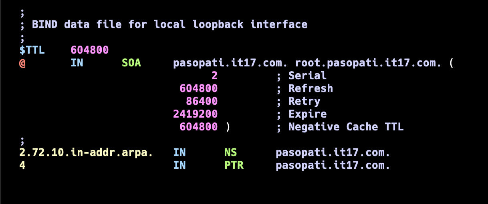
   Penjelasan lanjutan:
   Bisa dilihat klo `4` nya ditulis disitu
   NOTES: perhatikan titik setelah com.

7. `service bind9 restart`
8. Masuk web console client (yang gambar laptop)
9. `apt install dnsutils -y`
10. Pastiin udah ada nameserver si DNS di /etc/resolv.conf
11. `host -t PTR 10.72.2.4`
    Penjelasan `host -t PTR IPKOTALINGGA`
    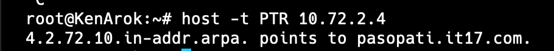

## SOAL 7

1. Masuk web console Majapahit
2. `apt install bind9 dnsutils -y`
3. `cd /etc/bind`
4. `vi named.conf.local`

Penjelasan:

```
...
masters {IP SRIWiJAYA;};
...
```

```

zone "sudarsana.it17.com" {
        type slave;
        masters {10.72.1.2;};
        file "/var/lib/bind/it17/sudarsana.it17.com";
};

zone "pasopati.it17.com" {
        type slave;
        masters {10.72.1.2;};
        file "/var/lib/bind/it17/pasopati.it17.com";
};

zone "rujapala.it17.com" {
        type slave;
        masters {10.72.1.2;};
        file "/var/lib/bind/it17/rujapala.it17.com";
};

zone "2.72.10.in-addr.arpa" {
        type slave;
        masters {10.72.1.2;};
        file "/var/lib/bind/it17/2.72.10.in-addr.arpa";
};
```

5. `service bind9 restart`
6. Masuk web console client (yang gambar laptop)
7. Pastiin udah ada nameserver dari DNS Slavenya
   `nameserver IP Majapahit`
   disini IP Majapahit ku `10.72.2.5`
   cek `cat /etc/resolv.conf`
8. Masuk web console Sriwijaya
9. `service bind9 stop`
10. Masuk web console client (yang gambar laptop)
11. coba ping salah satu domain
    `ping sudarsana.it17.com`
    
12. Kalo udah berhasil, nyalain lagi DNS Sriwijaya
13. Masuk web console Sriwijaya
14. `service bind9 start`

## SOAL 8

<!--  -->

1. Masuk web console Sriwijaya
2. `cd /etc/bind/it17`
3. `vi sudarsana.it17.com`
   tambahin kek baris paling bawah
   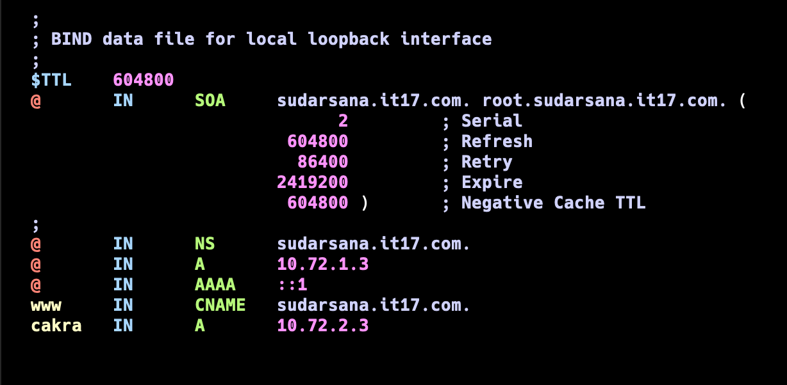
   NOTES: Perhatikan IP dibaris terakhir, gunakan IP dari Bedahulu buat bagian `cakra`
4. `service bind9 restart`
5. Masuk web console client (yang gambar laptop)
6. `ping cakra.sudarsana.it17.com`
   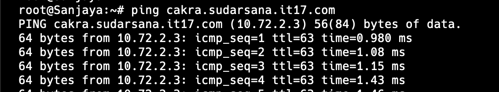

## SOAL 9

1. Masuk web console Sriwijaya
2. `cd /etc/bind/it17`
3. `vi pasopati.it17.com`
   tambahin 2 baris, baris `ns1` sama `panah`
   NOTES: IP dari `ns1` itu IP dari Majapahit
   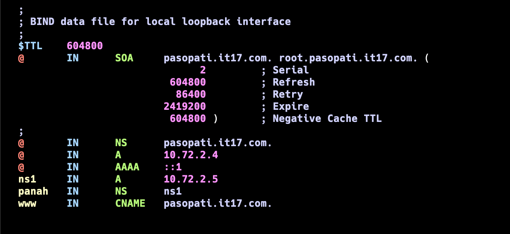
4. `cd ..`
5. `vi named.conf.options`
   edit jadi kek gini
   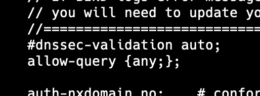
6. `vi named.conf.local`
7. edit zone pasopati jadi begini

```
zone "pasopati.it17.com" {
        type master;
        notify yes;
        also-notify {10.72.2.5;};
        allow-transfer {10.72.2.5;};
        file "/etc/bind/it17/pasopati.it17.com";
};
```

NOTES: `10.72.2.5` itu IP dari Majapahit

8. `service bind9 restart`
9. Masuk web console Majapahit
10. `cd /etc/bind`
11. `vi named.conf.options`
    edit jadi kek gini
    
12. `vi named.conf.local`
    tambahin zone baru

```
zone "panah.pasopati.it17.com" {
        type master;
        file "/etc/bind/panah/panah.pasopati.it17.com";
};
```

13. `mkdir panah && cd panah`
14. `cp ../db.local panah.pasopati.it17.com`
    trus ganti jadi kek gini
    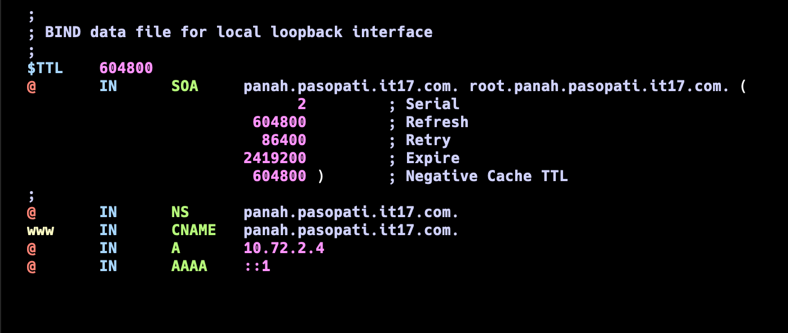
    Notes: `10.72.2.4` itu IP dari Kotalingga
15. `service bind9 restart`
16. Masuk web console client (yang gambar laptop)
17. `ping panah.pasopati.it17.com`

## SOAL 10

1. Masuk web console Majapahit
2. `cd /etc/bind`
3. `vi named.conf.local`
   tambahin zone

```
 zone "log.panah.pasopati.it17.com" {
        type master;
        file "/etc/bind/panah/log.panah.pasopati.it17.com";
};
```

4. `cd panah`
5. `cp panah.pasopati.it17.com log.panah.pasopati.it17.com`
6. `vi log.panah.pasopati.it17.com`
   ganti jadi begini
   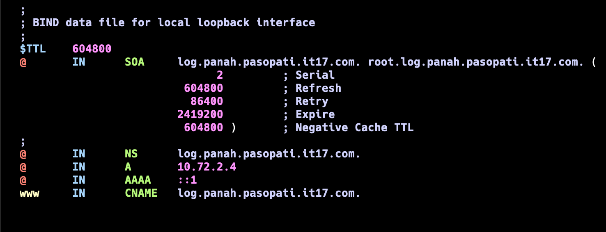
   Notes: `10.72.2.4` itu IP dari Kotalingga
7. `service bind9 restart`
8. Masuk web console client (yang gambar laptop)
9. `ping log.panah.pasopati.it17.com`
10. Kalo gabisa, ubah urutan nameserver di `/etc/resolv.conf` IP Majapahit dipaling atas

## SOAL 11

1. Berarti kita hapus line
   `nameserver 192.168.122.1`
   di file `/etc/resolv.conf` di SEMUA nodes kecuali Majapahit dan Nusantara
2. Masuk web console Majapahit
3. `cd /etc/bind`
4. `vi named.conf.options`
   ubah bagian `forwarders` jadi kek gini

   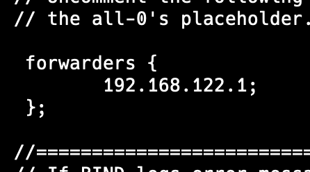

5. `service bind9 restart`
6. Masuk web console node lain (bebas) asalkan file `/etc/resolv.conf` TIDAK ADA `nameserver 192.168.122.1` dan punya `nameserver 10.72.2.5`
   Notes: `10.72.2.5` itu IP Majapahit

   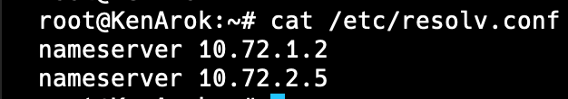

7. `ping google.com`

   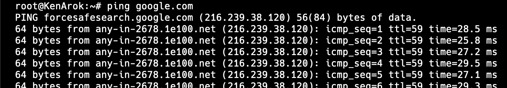

## SOAL 12

1. Masuk web console Kotalingga
2.

```
apt install lynx unzip apache2 libapache2-mod-wsgi python-dev libapache2-mod-php7.0 -y
```

3. `vi /var/www/html/index.php`
   lalu masukkan:

```php
<?php
$hostname = gethostname();
$date = date('Y-m-d H:i:s');
$php_version = phpversion();
$username = get_current_user();


echo "Hello World!<br>";
echo "Saya adalah: $username<br>";
echo "Saat ini berada di: $hostname<br>";
echo "Versi PHP yang saya gunakan: $php_version<br>";
echo "Tanggal saat ini: $date<br>";
?>
```

4. `rm /var/www/html/index.html`
5. `service apache2 start`
6. `lynx localhost`
   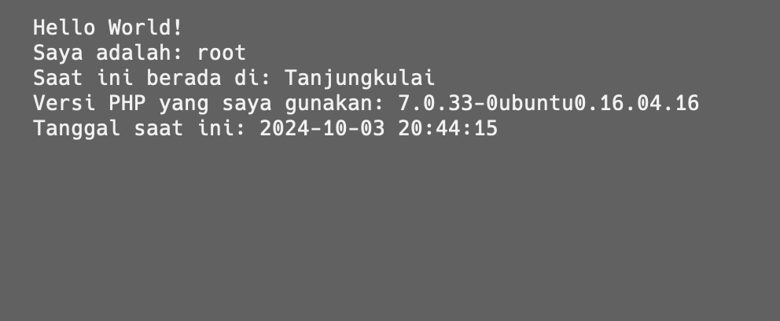
7. Lakukan hal yang sama untuk Tanjungkulai dan Bedahulu

## SOAL 13

1. Masuk web console Solok
2.

```
apt install lynx apache2 apache2-utils php7.0 php7.0-fpm -y
```

3.

```
a2enmod proxy proxy_balancer proxy_http lbmethod_byrequests lbmethod_bytraffic lbmethod_bybusyness
```

4. `cd /etc/apache2/sites-available`
5. `vi 000-default.conf`
   ubah jadi seperti ini
   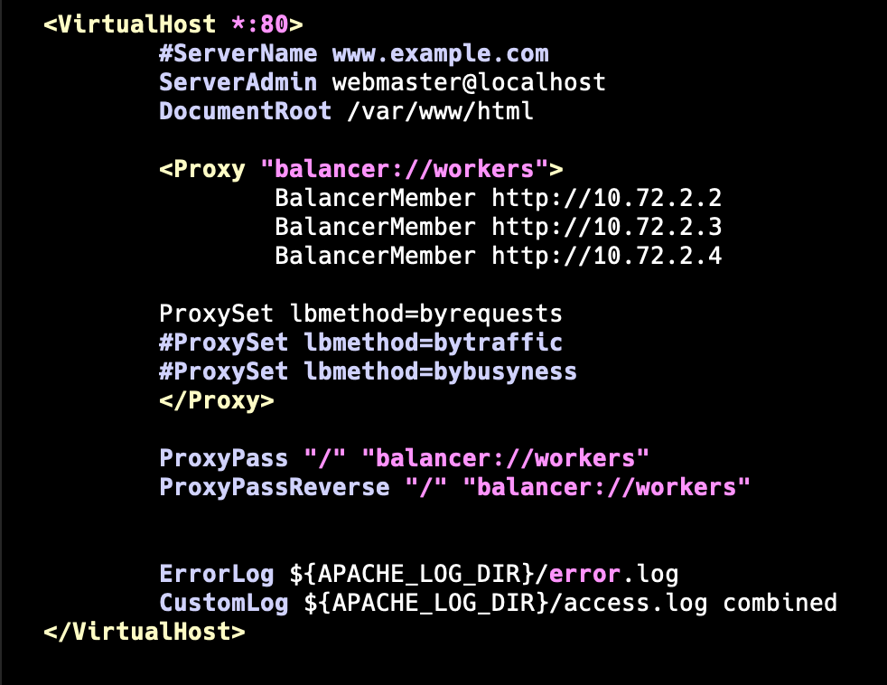
   Notes:
   IP `10.72.2.2` itu Tanjungkulai
   IP `10.72.2.2` itu Bedahulu
   IP `10.72.2.2` itu Kotalingga
6. `service apache2 start`
7. Masuk web console client (yang gambar laptop)
8. `apt install lynx -y`
9. `lynx localhost` (lakukan 3 kali)
   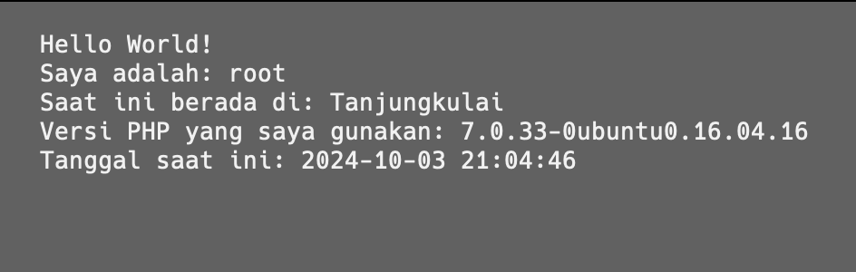
   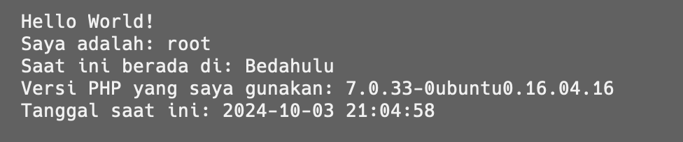
   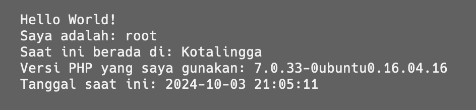
   Jika berhasil maka nanti akan menampilkan ketiga webserver
   perhatikan disini berubah-rubah secara random dari Tanjungkulai lalu Bedahulu lalu Kotalingga, disini menunjukkan LB berhasil

## SOAL 14

#### Kerjain soal no. 15 dlu (apache benchmarking)

1. Setelah no. 15 lanjut
2. Masuk web console Solok
3. `service apache2 stop`
4. `apt install nginx -y`
5. `cd /etc/nginx/sites-available`
6. `unlink /etc/nginx/sites-enabled/default`
7. `vi load-balancer` dan isi dengan:

```
upstream workers {
        server 10.72.2.2;
        server 10.72.2.3;
        server 10.72.2.4;
}

server {
        listen 80;
        server_name 10.72.1.3;

        location / {
        proxy_pass http://workers;
        }
}
```

Notes:

- `10.72.1.3` IP dari Solok
- `10.72.2.2` IP dari Tanjungulai
- `10.72.2.3` IP dari Bedahulu
- `10.72.2.4` IP dari Kotalingga

8.

```
ln -s /etc/nginx/sites-available/load-balancer /etc/nginx/sites-enabled/
```

9. `service nginx start`
10. Masuk web console dari Tanjungkulai, Bedahulu, Kotalingga (konfigurasi dan step sama)
11. `apt install nginx php7.0 php7.0-fpm -y`
12. `cd /etc/nginx/sites-available`
13. `vi web` lalu isi dengan

```
server {
  listen 80;

  root /var/www/html;

  index index.php index.html index.htm;

  server_name _;

  location / {
    try_files $uri $uri/ /index.php?$query_string;
  }

  location ~ \.php$ {
    include snippets/fastcgi-php.conf;
    fastcgi_pass unix:/var/run/php/php7.0-fpm.sock;
  }

  location ~ /\.ht {
    deny all;
  }

  error_log /var/log/nginx/web_error.log;
  access_log /var/log/nginx/web_access.log;


}
```

14. `unlink /etc/nginx/sites-enabled/default`
15.

```
ln -s /etc/nginx/sites-available/web /etc/nginx/sites-enabled/
```

16. `service apache2 stop`
17. `service nginx start`
18. `service php7.0-fpm start`
19. BALIK KE SOAL 15 no.10

## SOAL 15

1. Masuk web console Solok
2. Pertama kita akan benchmark load balancer apache2 dengan algoritma defaultnya (byrequests)
   `ab -n 100 -c 10 http://127.0.0.1/`
   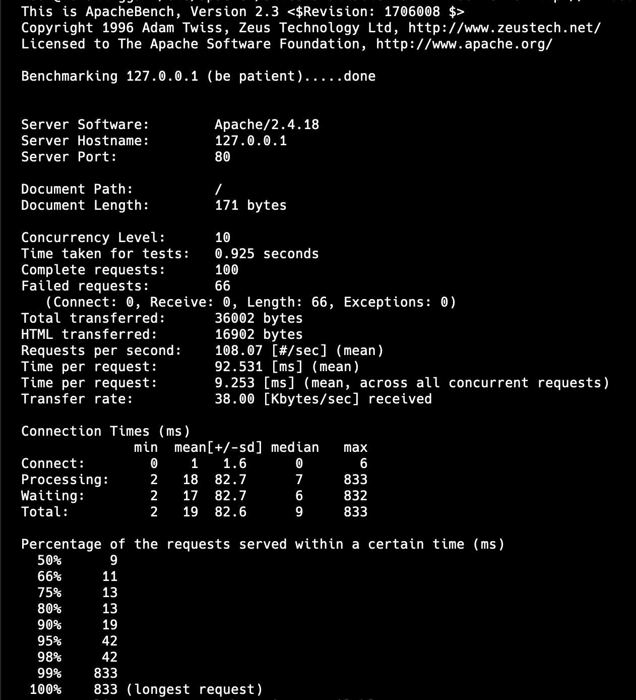

   simpan hasil benchmark (bebas mau di ss ato di copy)

3. Sekarang ganti algoritmanya
4. `cd /etc/apache2/sites-available` `vi 000-default.con`
   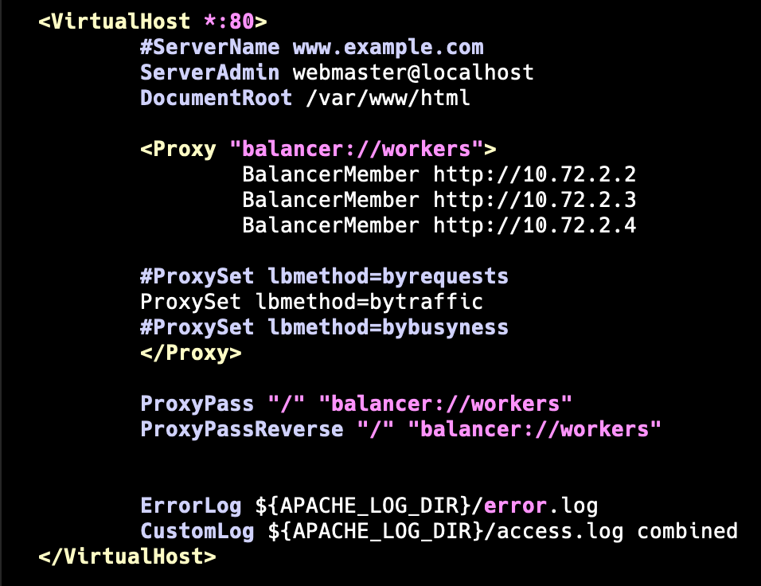
   Perhatikan bagian `ProxySet`, disini kita bikin lbmethod jadi bytraffic
5. `service apache2 restart`
6. lalu kita benchmark lagi
   `ab -n 100 -c 10 http://127.0.0.1/`

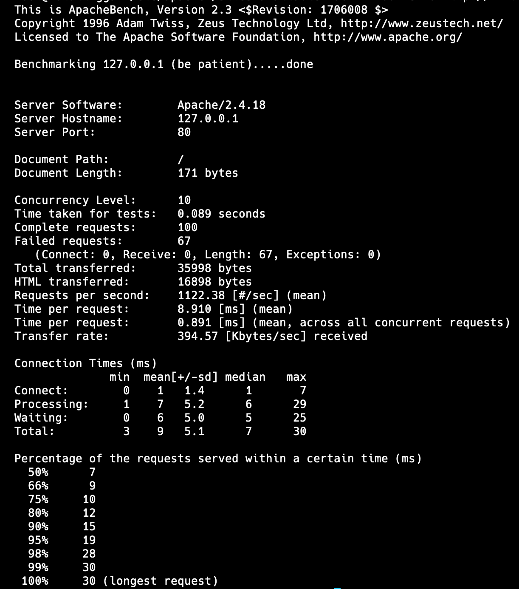
simpan hasil benchmark

7. Sekarang ganti lagi, `vi 000-default.conf`
   
   kita ganti jadi bybusyness

simpan hasil benchmark

8. lalu kita benchmark lagi
   `ab -n 100 -c 10 http://127.0.0.1/`
   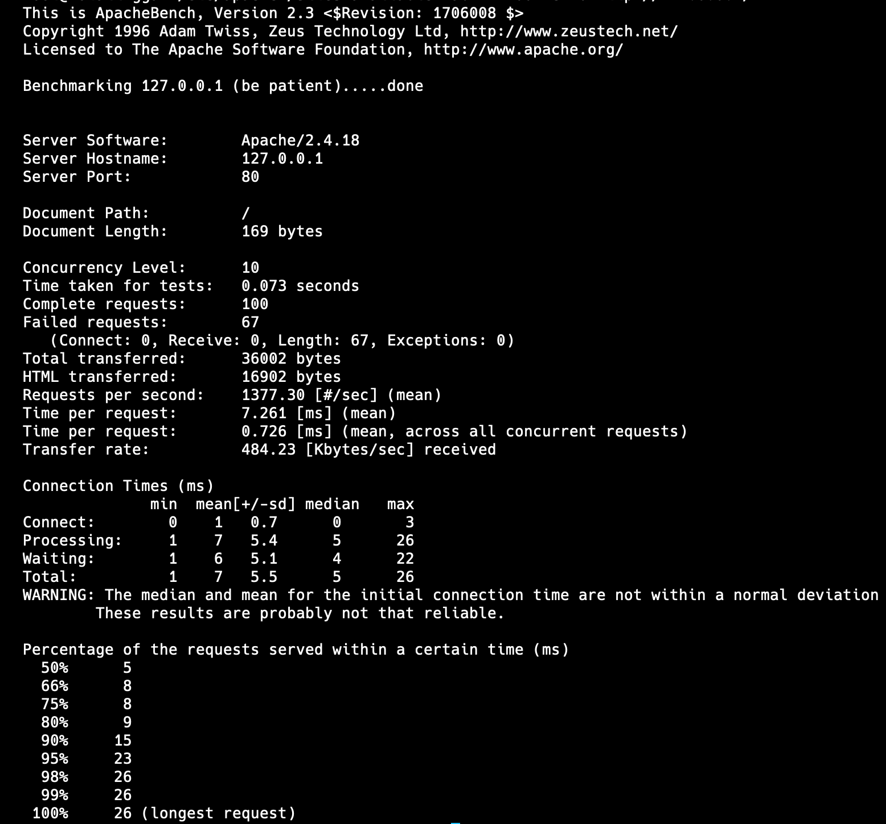
9. Sekarang kita ganti load balancer dan webserver jadi nginx BALIK KE SOAL 14
10. Setelah lanjut dari SOAL 14
11. Masuk web console Solok
12. benchmark lagi `ab -n 100 -c 10 http://127.0.0.1/`
    simpan hasil benchmark

13. `vi /etc/nginx/sites-available/web`
    tambahin `least_conn;`
    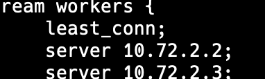

14. benchmark lagi `ab -n 100 -c 10 http://127.0.0.1/`
    simpan hasil benchmark

## SOAL 16

1. Masuk web console Sriwijaya
2. `cd /etc/bind`
3. `vi named.conf.local`
   tambahkan zone baru
   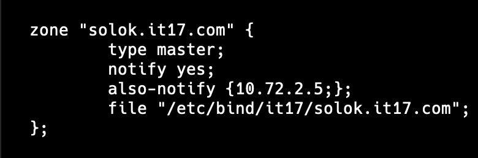
4. `cd it17`
   1. `cp sudarsana.it17.com solok.it17.com`
   2. `vi solok.it17.com`
      lalu ganti nama domainnya menjadi solok.it17.com
      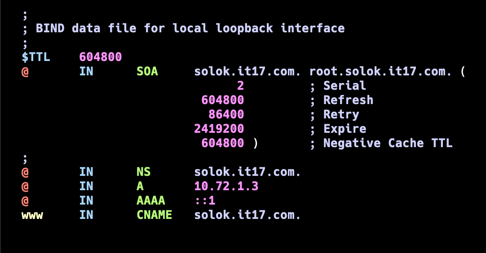
5. `service bind9 restart`
6. Masuk web console Solok
7. `cd /etc/apache2/sites-available`
8. `cp 000-default.conf solok.it17.com.conf`
9. `vi solok.it17.com.conf`
   ganti `ServerName` dan `ServerAlias` seperti ini
   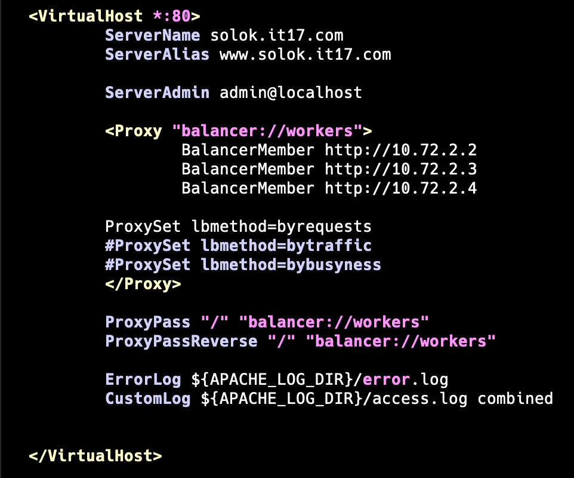
10. `cd ..` `vi apache2.conf`
    lalu tambahkan line `ServerName solok.it17.com`
    bebas ditaro dibagian mana aja
    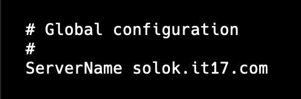

11. `a2dissite 000-default.com`
12. `a2ensite solok.it17.com`
13. `service apache2 restart`
14. Masuk ke web console client bebas (yang gambar laptop)
15. `cat /etc/resolv.conf`
    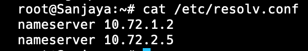
    pastikan DNS Sriwijaya ada paling atas

    Notes:

    - `10.72.1.2` IP SRIWIJAYA
    - `10.72.2.5` IP MAJAPAHIT

16. `lynx solok.it17.com`
    coba 3 kali disini
    
    
    

## SOAL 17

1. Masuk web console Solok
2. `cd /etc/apache2`
3. `vi ports.conf`
   tambahkan line Listen 4696 (sesuai perhitungan soal)
   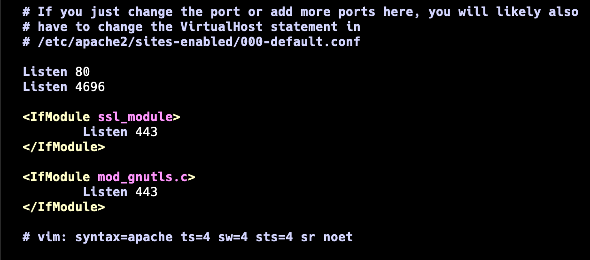
4. `rm /var/www/html/*`
5. `cd sites-available`
6. `vi solok.it17.com`
   lalu ganti jadi `4696`disini
   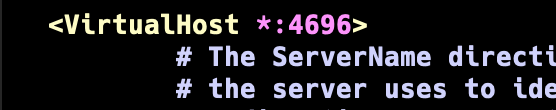
7. `service apache2 restart`
8. Masuk web console client (yang gambar laptop)
9. `lynx solok.it17.com`
   
10. `lynx solok.it17.com:4696`
    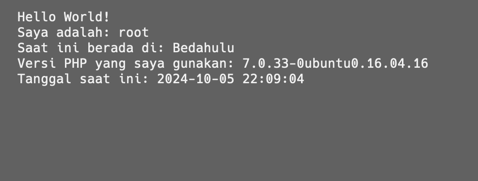

## SOAL 18

1. Masuk web console Solok
2. `cd /etc/apache2/sites-available`
3. `vi redirect.conf` dan isi seperti ini

```
<VirtualHost *:80>
        ErrorLog ${APACHE_LOG_DIR}/error.log
        CustomLog ${APACHE_LOG_DIR}/access.log combined

        RewriteEngine On
        RewriteRule ^(.*)$ http://solok.it17.com:4696/$1 [R=301,L]
</VirtualHost>

# vim: syntax=apache ts=4 sw=4 sts=4 sr noet
```

4. `a2enmod rewrite`
5. `a2ensite redirect.conf`
6. `service apache2 restart`
7. Masuk web console client (yang gambar laptop)
8. `lynx 10.72.1.3` IP dari Solok
   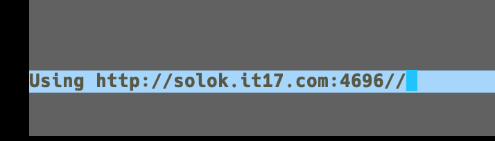
   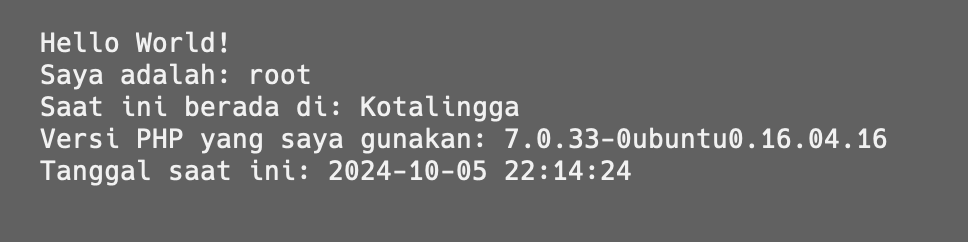

## SOAL 19 dan SOAL 20

1. Masuk web console worker (Bebas antara Tanjungkulai, Bedahulu, Kotalingga), disini aku pake Bedahulu
2. `cd /etc/apache2/sites-available`
3. `vi sekiantterimakasih.it17.com.conf`

```
<VirtualHost *:80>

        ServerName sekiantterimakasih.it17.com
        ServerAlias www.sekiantterimakasih.it17.com
        ServerAdmin webmaster@localhost
        DocumentRoot /var/www/sekiantterimakasih.it17.com

        <Directory "/var/www/sekiantterimakasih.it17.com/worker2">
                Options +Indexes
        </Directory>

        ErrorLog ${APACHE_LOG_DIR}/error.log
        CustomLog ${APACHE_LOG_DIR}/access.log combined

</VirtualHost>

# vim: syntax=apache ts=4 sw=4 sts=4 sr noet
```

3. `a2ensite sekiantterimakasih.it17.com`
4. `cd /var/www/`
5.

```
   curl -L -o dirlist.zip --insecure "https://drive.google.com/uc?export=download&id=1JGk8b-tZgzAOnDqTx5B3F9qN6AyNs7Zy"
```

6. `apt install unzip && unzip dirlist.zip`
7. `mkdir sekiantterimakasih.it17.com`
8. `cd dir-listing`
9. `mv worker2 ../sekiantterimakasih.it17.com`
10. Masuk web console Sriwijaya
11. `cd /etc/bind/ && vi named.conf.local`
12. tambahkan zone baru
    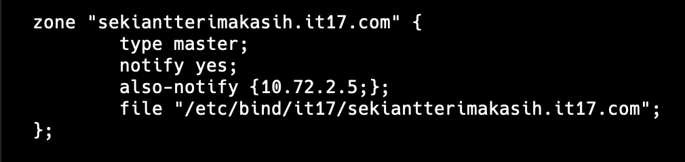
13. `cd it17`
14. `vi sekiantterimakasih.it17.com`

```

; BIND data file for local loopback interface
;
$TTL 604800
@ IN SOA sekiantterimakasih.it17.com. root.solok.it17.com. (
2 ; Serial
604800 ; Refresh
86400 ; Retry
2419200 ; Expire
604800 ) ; Negative Cache TTL
;
@ IN NS sekiantterimakasih.it17.com.
@ IN A 10.72.2.3 ; IP DARI BEDAHULU
@ IN AAAA ::1
www IN CNAME sekiantterimakasih.it17.com.

```

Notes: `10.72.2.3` itu IP Bedahulu, sesuai kalian tadi settingnya di webserver mana (Kotalingga atau Bedahulu atau Tanjungkulai)

15. `service bind9 restart`
16. Masuk ke client (yang gambar laptop)
17. `lynx sekiantterimakasih.it17.com/worker2`
    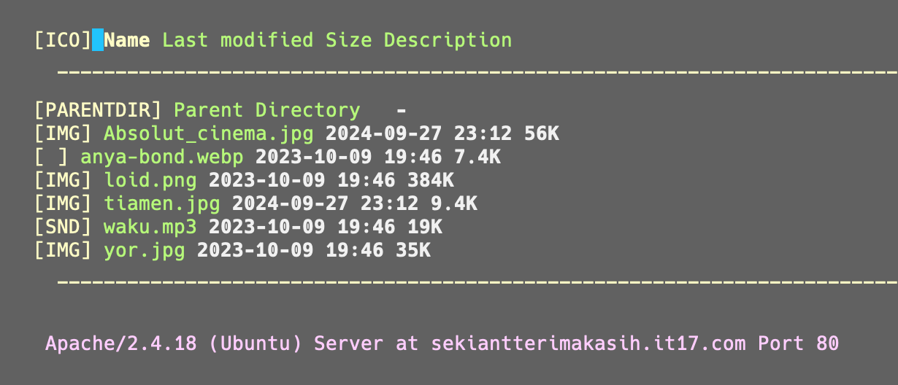
