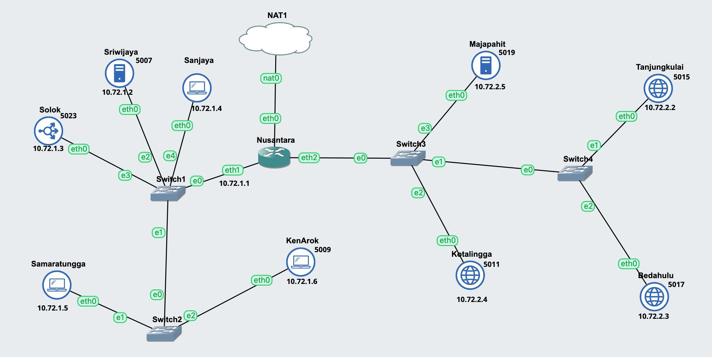
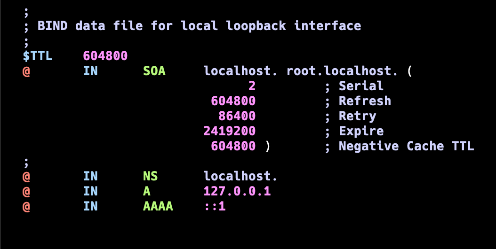
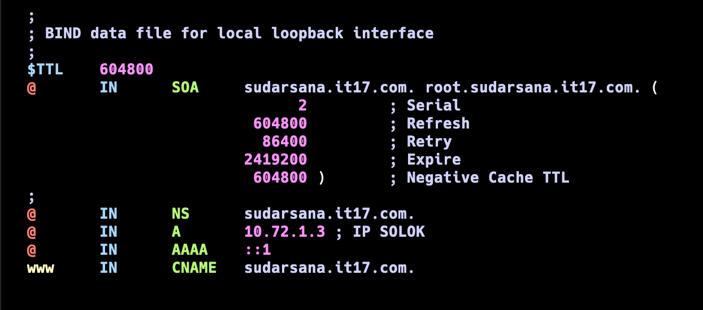
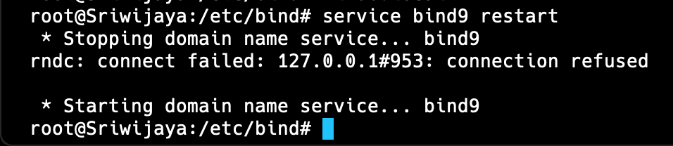

# DOKUMENTASI

## IMPORTANT

## PERSISTENT DISK (ALL DEVICES)

on your terminal run

cp -r /etc /root/etc-persistent
cp -r /usr /root/usr-persistent
cp -r /var /root/var-persistent

mount --bind /root/etc-persistent /etc
mount --bind /root/usr-persistent /usr
mount --bind /root/var-persistent /var

vi /etc/fstab
//didalem /etc/fstab
/root/etc-persistent /etc none bind 0 0
/root/usr-persistent /usr none bind 0 0
/root/var-persistent /var none bind 0 0

cd /root
vi restore.sh
//didalem restore.sh
#!/bin/bash
cp -r /root/etc-persistent/_ /etc/
cp -r /root/usr-persistent/_ /usr/
cp -r /root/var-persistent/\* /var/

mount --bind /root/etc-persistent /etc
mount --bind /root/usr-persistent /usr
mount --bind /root/var-persistent /var

misal ke reset:

bash restore.sh
//run ketika ke reset aja

## TOPOLOGY



## SOAL 1

### Nusantara

```
auto eth0
iface eth0 inet dhcp

auto eth1
iface eth1 inet static
	address 10.72.1.1
	netmask 255.255.255.0

auto eth2
iface eth2 inet static
	address 10.72.2.1
	netmask 255.255.255.0

up iptables -t nat -A POSTROUTING -o eth0 -j MASQUERADE -s 10.72.0.0/16
```

### Tanjungkulai

```
auto eth0
iface eth0 inet static
  address 10.72.2.2
  netmask 255.255.255.0
  gateway 10.72.2.1

up echo nameserver 10.72.1.2 > /etc/resolv.conf
up echo nameserver 10.72.2.5 >> /etc/resolv.conf
```

### Bedahulu

```
auto eth0
iface eth0 inet static
  address 10.72.2.3
  netmask 255.255.255.0
  gateway 10.72.2.1

up echo nameserver 10.72.1.2 > /etc/resolv.conf
up echo nameserver 10.72.2.5 >> /etc/resolv.conf
```

### Sriwijaya

```
auto eth0
iface eth0 inet static
  address 10.72.1.2
  netmask 255.255.255.0
  gateway 10.72.1.1

up echo nameserver 192.168.122.1 > /etc/resolv.conf
```

### Majapahit

```
auto eth0
iface eth0 inet static
  address 10.72.2.5
  netmask 255.255.255.0
  gateway 10.72.2.1

up echo nameserver 192.168.122.1 > /etc/resolv.conf
up echo nameserver 10.72.1.2 >> /etc/resolv.conf
```

## SOAL 2

Masuk ke Web Console Sriwijaya

1. apt update && apt install bind9 dnsutils -y
2. cd /etc/bind
3. vi named.conf.local

```
// Didalam named.conf.local


//TEMPLATE (HAPUS //)
//zone "namadomain.itxx.com" {
//  type master;
//  file "/etc/bind/itxx/namadomain.itxx.com";
//}

zone "sudarsana.it17.com" {
  type master;
  file "/etc/bind/it17/sudarsana.it17.com";
}

// SAVE FILE
```

4. mkdir /etc/bind/it17
5. cd it17
6. cp ../db.local sudarsana.it17.com
7. vi sudarsana.it17.com

Nanti tampilannya seperti ini


Ubah menjadi seperti ini


8. service bind9 restart
   

Untuk mengecek error pada config:
`named-checkconf`

Untuk mengecek error pada config zone:

```
named-checkzone namadomain.itxx.com /etc/bind/itxx/namadomain.itxx.com
```
