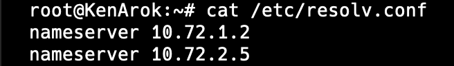
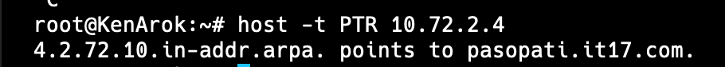
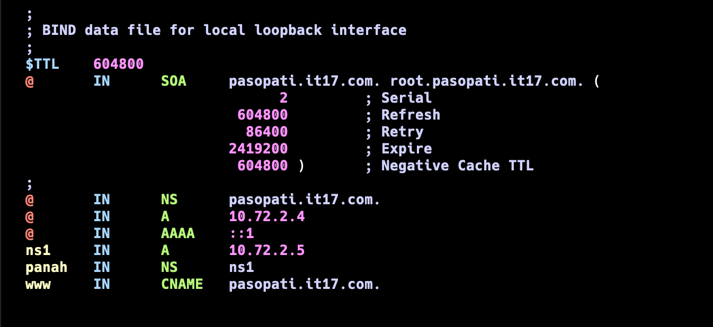
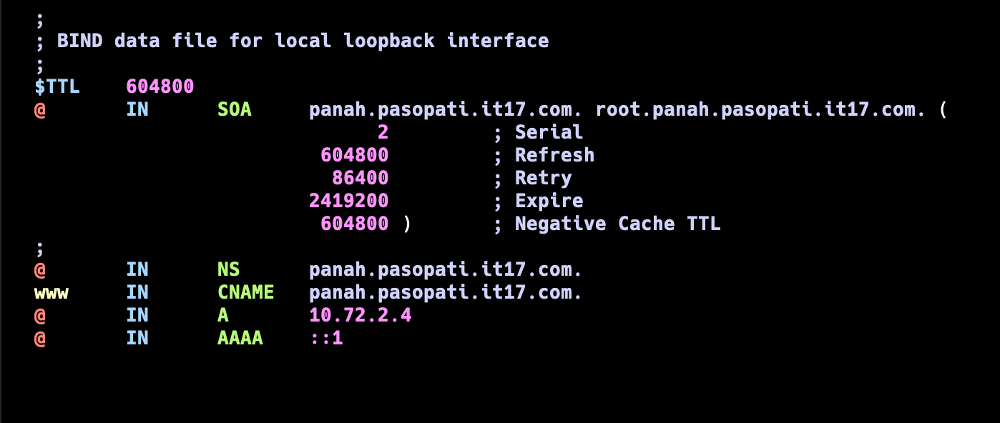
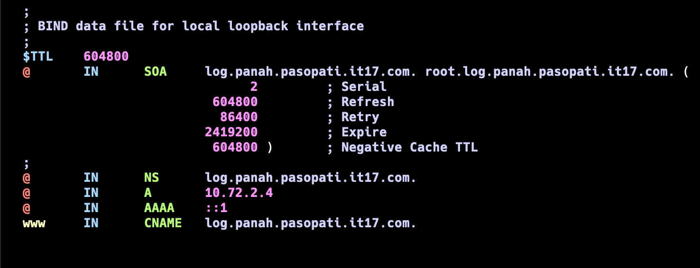
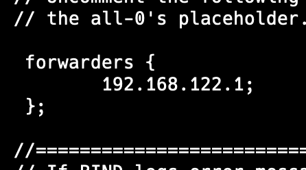
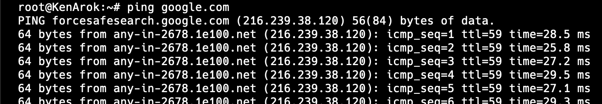

# DOKUMENTASI

## PERSISTENT DISK (ALL DEVICES) IMPORTANT

jalanin ini sekali aja di SEMUA NODES (kecuali Nusantara)
Masuk web console

```
cp -r /etc /root/etc-persistent
cp -r /usr /root/usr-persistent
cp -r /var /root/var-persistent

mount --bind /root/etc-persistent /etc
mount --bind /root/usr-persistent /usr
mount --bind /root/var-persistent /var
```

`vi /etc/fstab`
isi begini:

```
/root/etc-persistent /etc none bind 0 0
/root/usr-persistent /usr none bind 0 0
/root/var-persistent /var none bind 0 0
```

`cd /root`
`vi restore.sh`
isi begini:

```
#!/bin/bash
cp -r /root/etc-persistent/* /etc/
cp -r /root/usr-persistent/* /usr/
cp -r /root/var-persistent/* /var/

mount --bind /root/etc-persistent /etc
mount --bind /root/usr-persistent /usr
mount --bind /root/var-persistent /var
```

cara penggunaan:
misal ke reset tinggal jalanin

```
bash /root/restore.sh
```

Q: Emang bakal ke reset?
A: Klo engga berarti keren

## TOPOLOGY


## SOAL 1

NOTES:
IP `10.72.1.2` itu IP Sriwijaya (DNS MASTER)

---

IP `10.72.2.5` itu IP Majapahit (DNS SLAVE)

### Nusantara

```
auto eth0
iface eth0 inet dhcp

auto eth1
iface eth1 inet static
	address 10.72.1.1
	netmask 255.255.255.0

auto eth2
iface eth2 inet static
	address 10.72.2.1
	netmask 255.255.255.0

up iptables -t nat -A POSTROUTING -o eth0 -j MASQUERADE -s 10.72.0.0/16
```

### Tanjungkulai

```
auto eth0
iface eth0 inet static
  address 10.72.2.2
  netmask 255.255.255.0
  gateway 10.72.2.1
up echo nameserver 10.72.1.2 > /etc/resolv.conf
up echo nameserver 10.72.2.5 >> /etc/resolv.conf
up echo nameserver 192.168.122.1 >> /etc/resolv.conf
```

### Bedahulu

```
auto eth0
iface eth0 inet static
  address 10.72.2.3
  netmask 255.255.255.0
  gateway 10.72.2.1

up echo nameserver 10.72.1.2 > /etc/resolv.conf
up echo nameserver 10.72.2.5 >> /etc/resolv.conf
up echo nameserver 192.168.122.1 >> /etc/resolv.conf
```

### Sriwijaya

```
auto eth0
iface eth0 inet static
  address 10.72.1.2
  netmask 255.255.255.0
  gateway 10.72.1.1

up echo nameserver 192.168.122.1 > /etc/resolv.conf
```

### Majapahit

```
auto eth0
iface eth0 inet static
  address 10.72.2.5
  netmask 255.255.255.0
  gateway 10.72.2.1

up echo nameserver 10.72.1.2 > /etc/resolv.conf
up echo nameserver 192.168.122.1 >> /etc/resolv.conf
```

### KenArok

```
auto eth0
iface eth0 inet static
  address 10.72.1.6
  netmask 255.255.255.0
  gateway 10.72.1.1

up echo nameserver 10.72.1.2 > /etc/resolv.conf
up echo nameserver 10.72.2.5 >> /etc/resolv.conf
```

### Kotalingga

```
aut0 eth0
iface eth0 inet static
  address 10.72.2.4
  netmask 255.255.255.0
  gateway 10.72.2.1

up echo nameserver 10.72.1.2 > /etc/resolv.conf
up echo nameserver 10.72.2.5 >> /etc/resolv.conf
up echo nameserver 192.168.122.1 >> /etc/resolv.conf
```

### Samaratungga

```
auto eth0
iface eth0 inet static
  address 10.72.1.5
  netmask 255.255.255.0
  gateway 10.72.1.1

up echo nameserver 10.72.1.2 > /etc/resolv.conf
up echo nameserver 10.72.2.5 >> /etc/resolv.conf
up echo nameserver 192.168.122.1 >> /etc/resolv.conf
```

### Solok

```
auto eth0
iface eth0 inet static
  address 10.72.1.3
  netmask 255.255.255.0
  gateway 10.72.1.1

up echo nameserver 10.72.1.2 > /etc/resolv.conf
up echo nameserver 10.72.2.5 >> /etc/resolv.conf
up echo nameserver 192.168.122.1 >> /etc/resolv.conf
```

### Sanjaya

```
auto eth0
iface eth0 inet static
  address 10.72.1.4
  netmask 255.255.255.0
  gateway 10.72.1.1

up echo nameserver 10.72.1.2 > /etc/resolv.conf
up echo nameserver 10.72.2.5 >> /etc/resolv.conf
up echo nameserver 192.168.122.1 >> /etc/resolv.conf
```

Notes:
`nameserver 192.168.122.1` hanya digunakan untuk install2 package di awal, nantinya yang punya nameserver itu cuman Majapahit

## SOAL 2

Masuk ke Web Console Sriwijaya

1. `apt update && apt install bind9 dnsutils -y`
2. `cd /etc/bind`
3. `vi named.conf.local`

```
// Didalam named.conf.local


//TEMPLATE (HAPUS //)
//zone "namadomain.itxx.com" {
//  type master;
//  file "/etc/bind/itxx/namadomain.itxx.com";
//};

zone "sudarsana.it17.com" {
  type master;
  file "/etc/bind/it17/sudarsana.it17.com";
};

// SAVE FILE
```

4. `mkdir /etc/bind/it17`
5. `cd it17`
6. `cp ../db.local sudarsana.it17.com`
7. `vi sudarsana.it17.com`

Nanti tampilannya seperti ini


Ubah menjadi seperti ini


8. `service bind9 restart`
   

Untuk mengecek error pada config:
`named-checkconf`

Untuk mengecek error pada config zone:

```
named-checkzone namadomain.itxx.com /etc/bind/itxx/namadomain.itxx.com
```

9. Masuk ke web console client bebas (yang gambar laptop)

10. Pastiin udah ada nameserver dari DNSnya
    cek `cat /etc/resolv.conf`
11. Kalo GAADA di tambahin

    ```
    echo nameserver 10.72.1.2 >> /etc/resolv.conf
    ```

    ```
    echo nameserver 10.72.1.5 >> /etc/resolv.conf
    ```

    notes:
    `10.72.1.2` disini itu IP dari Sriwijaya (DNS MASTER)
    `10.72.2.5` disini itu IP dari Majapahit (DNS SLAVE)

12. ping sudarsana.it17.com
    
    yey berhasil

## SOAL 3

Masuk ke Web Console Sriwijaya

1. `cd /etc/bind`
2. `vi named.conf.local`

```
// Didalam named.conf.local


//TEMPLATE (HAPUS //)
//zone "namadomain.itxx.com" {
//  type master;
//  file "/etc/bind/itxx/namadomain.itxx.com";
//};

zone "sudarsana.it17.com" {
  type master;
  file "/etc/bind/it17/sudarsana.it17.com";
};

zone "pasopati.it17.com" {
  type master;
  file "/etc/bind/it17/pasopati.it17.com";
};

// SAVE FILE
```

3. `cd it17`
4. `cp sudarsana.it17.com pasopati.it17.com`
5. `vi pasopati.it17.com`

Nanti tampilannya seperti ini


Ubah menjadi seperti ini
 8. `service bind9 restart`


Untuk mengecek error pada config:
`named-checkconf`

Untuk mengecek error pada config zone:

```
named-checkzone namazone.itxx.com /etc/bind/itxx/namazone.itxx.com
```

## SOAL 4

step sama kek soal 2 dan 3

## SOAL 5

1. Masuk ke web console client (yang gambar laptop)
2. jalanin command di bawah
   Notes: sebernya gaperlu karena di Network Configuration tadi udah di add tapi kalo gabisa pake ini:

```
echo nameserver 10.72.1.2 >> /etc/resolv.conf
```

```
echo nameserver 10.72.1.5 >> /etc/resolv.conf
```

notes:
`10.72.1.2` disini itu IP dari Sriwijaya (DNS MASTER)
`10.72.2.5` disini itu IP dari Majapahit (DNS SLAVE)

## SOAL 6

1. Masuk web console Sriwijaya
2. `cd /etc/bind`
3. `vi named.conf.local`
   tambahin zone baru:

```
zone "2.72.10.in-addr.arpa" {
  type master;
  file "/etc/bind/it17/2.72.10.in-addr.arpa";
};
```

Penjelasan dikit:
IP Kotalingga di Topology ku: 10.72.2.4
dibalik jadi
2.72.10 (4 nya ilangin disini nanti add di step selanjutnya)

4. `cd it17`
5. `cp pasopati.it17.com 2.72.10.in-addr.arpa`
6. samain kek gini
   
   Penjelasan lanjutan:
   Bisa dilihat klo `4` nya ditulis disitu
   NOTES: perhatikan titik setelah com.

7. `service bind9 restart`
8. Masuk web console client (yang gambar laptop)
9. `apt install dnsutils -y`
10. Pastiin udah ada nameserver si DNS di /etc/resolv.conf
11. `host -t PTR 10.72.2.4`
    Penjelasan `host -t PTR IPKOTALINGGA`
    

## SOAL 7

1. Masuk web console Majapahit
2. `apt install bind9 dnsutils -y`
3. `cd /etc/bind`
4. `vi named.conf.local`

Penjelasan:

```
...
masters {IP SRIWiJAYA;};
...
```

```

zone "sudarsana.it17.com" {
        type slave;
        masters {10.72.1.2;};
        file "/var/lib/bind/it17/sudarsana.it17.com";
};

zone "pasopati.it17.com" {
        type slave;
        masters {10.72.1.2;};
        file "/var/lib/bind/it17/pasopati.it17.com";
};

zone "rujapala.it17.com" {
        type slave;
        masters {10.72.1.2;};
        file "/var/lib/bind/it17/rujapala.it17.com";
};

zone "2.72.10.in-addr.arpa" {
        type slave;
        masters {10.72.1.2;};
        file "/var/lib/bind/it17/2.72.10.in-addr.arpa";
};
```

5. `service bind9 restart`
6. Masuk web console client (yang gambar laptop)
7. Pastiin udah ada nameserver dari DNS Slavenya
   `nameserver IP Majapahit`
   disini IP Majapahit ku `10.72.2.5`
   cek `cat /etc/resolv.conf`
8. Masuk web console Sriwijaya
9. `service bind9 stop`
10. Masuk web console client (yang gambar laptop)
11. coba ping salah satu domain
    `ping sudarsana.it17.com`
    
12. Kalo udah berhasil, nyalain lagi DNS Sriwijaya
13. Masuk web console Sriwijaya
14. `service bind9 start`

## SOAL 8

<!--  -->

1. Masuk web console Sriwijaya
2. `cd /etc/bind/it17`
3. `vi sudarsana.it17.com`
   tambahin kek baris paling bawah
   
   NOTES: Perhatikan IP dibaris terakhir, gunakan IP dari Bedahulu buat bagian `cakra`
4. `service bind9 restart`
5. Masuk web console client (yang gambar laptop)
6. `ping cakra.sudarsana.it17.com`

## SOAL 9

1. Masuk web console Sriwijaya
2. `cd /etc/bind/it17`
3. `vi pasopati.it17.com`
   tambahin 2 baris, baris `ns1` sama `panah`
   NOTES: IP dari `ns1` itu IP dari Majapahit
   
4. `cd ..`
5. `vi named.conf.options`
   edit jadi kek gini
   
6. `vi named.conf.local`
7. edit zone pasopati jadi begini

```
zone "pasopati.it17.com" {
        type master;
        notify yes;
        also-notify {10.72.2.5;};
        allow-transfer {10.72.2.5;};
        file "/etc/bind/it17/pasopati.it17.com";
};
```

NOTES: `10.72.2.5` itu IP dari Majapahit

8. `service bind9 restart`
9. Masuk web console Majapahit
10. `cd /etc/bind`
11. `vi named.conf.options`
    edit jadi kek gini
    
12. `vi named.conf.local`
    tambahin zone baru

```
zone "panah.pasopati.it17.com" {
        type master;
        file "/etc/bind/panah/panah.pasopati.it17.com";
};
```

13. `mkdir panah && cd panah`
14. `cp ../db.local panah.pasopati.it17.com`
    trus ganti jadi kek gini
    
    Notes: `10.72.2.4` itu IP dari Kotalingga
15. `service bind9 restart`
16. Masuk web console client (yang gambar laptop)
17. `ping panah.pasopati.it17.com`

## SOAL 10

1. Masuk web console Majapahit
2. `cd /etc/bind`
3. `vi named.conf.local`
   tambahin zone

```
 zone "log.panah.pasopati.it17.com" {
        type master;
        file "/etc/bind/panah/log.panah.pasopati.it17.com";
};
```

4. `cd panah`
5. `cp panah.pasopati.it17.com log.panah.pasopati.it17.com`
6. `vi log.panah.pasopati.it17.com`
   ganti jadi begini
   
   Notes: `10.72.2.4` itu IP dari Kotalingga
7. `service bind9 restart`
8. Masuk web console client (yang gambar laptop)
9. `ping log.panah.pasopati.it17.com`
10. Kalo gabisa, ubah urutan nameserver di `/etc/resolv.conf` IP Majapahit dipaling atas

## SOAL 11

1. Berarti kita hapus line
   `nameserver 192.168.122.1`
   di file `/etc/resolv.conf` di SEMUA nodes kecuali Majapahit dan Nusantara
2. Masuk web console Majapahit
3. `cd /etc/bind`
4. `vi named.conf.options`
   ubah bagian `forwarders` jadi kek gini

   

5. `service bind9 restart`
6. Masuk web console node lain (bebas) asalkan file `/etc/resolv.conf` TIDAK ADA `nameserver 192.168.122.1` dan punya `nameserver 10.72.2.5`
   Notes: `10.72.2.5` itu IP Majapahit

   

7. `ping google.com`

   
